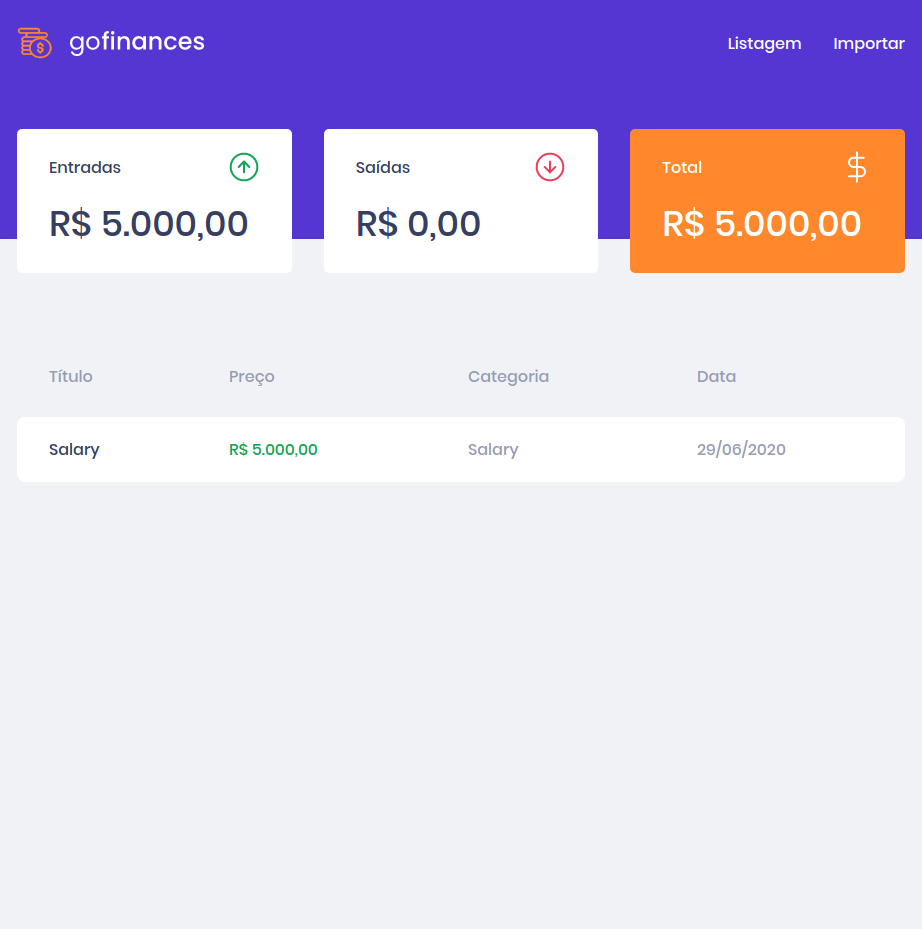
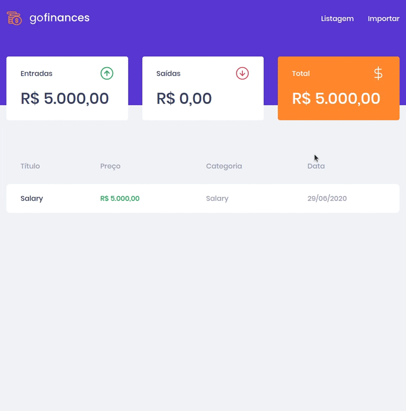
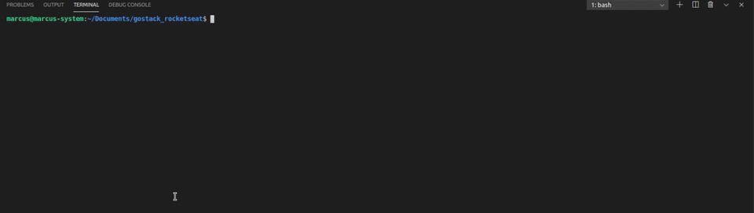
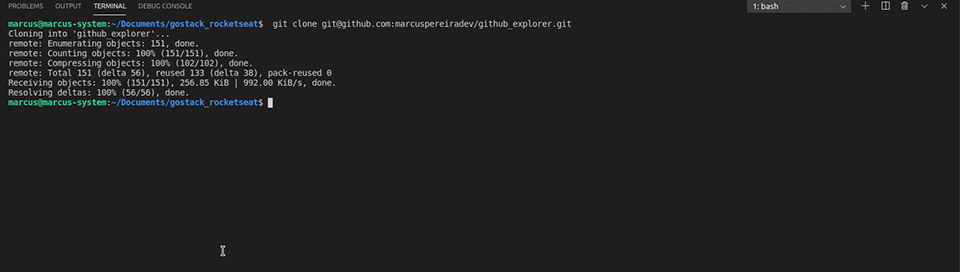
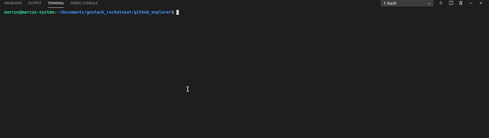

<h1 align="center">
  GoFinances
</h1>

<p align="center">Finances system built Reac.js and Typescript.</p>

<br />

## Features

* List the total balance inside the cards.
* List the transactions.
* Import CSV file. Exemple.: [CSV File](./docs/file.csv)

<p align="center">
  
</p>

<br />

<p align="center">
  
</p>

## Installation

This application will connect with [typeorm-upload](https://github.com/marcuspereiradev/gostack-template-typeorm-upload) API.

You may clone this repository.

```
  git clone git@github.com:marcuspereiradev/GoFinances.git
```

<p align="center">
  
</p>

<br />

Inside the created directory run the scripts in order to execute the application.

```
  // Install the dependencies
  yarn install
```

<p align="center">
  
</p>

<br />

```
  // Start the application
  yarn start
```

<p align="center">
  
</p>

<br />

## Authors

|  [Marcus Pereira](https://github.com/marcuspereiradev)   |
